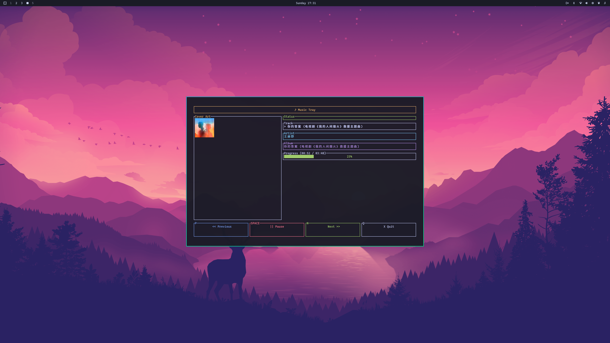

# music-tray

A small music control tool for Linux operating systems that can display the content of songs currently playing in music software, including music cover, song title, and playback progress, with buttons for previous track, next track, pause and play.




## Features
- 🎵 Display current playing music information (song title, artist, album)
- ⏯️ Music control (play/pause, previous track, next track)
- 📊 Playback progress bar display
- 🎨 Beautiful TUI interface
- 🔄 Real-time music status updates
- 🔌 MPRIS integration framework (supports Spotify, VLC, Rhythmbox, etc.)
- 🎛️ D-Bus connection management

## Constraints
- Use https://github.com/ratatui/ratatui to implement the interactive interface
- Developed using Rust language

## Building and Running

### Build the project
```bash
cargo build --release
```

### Run the application
```bash
cargo run
```

### Control keys
- `SPACE` - Play/Pause
- `N` - Next track
- `P` - Previous track
- `Q` - Quit application

## Technical Implementation

- **TUI Framework**: ratatui (based on crossterm)
- **Music Control**: MPRIS (Media Player Remote Interfacing Specification)
- **Async Runtime**: tokio
- **D-Bus Communication**: zbus
- **Serialization**: serde
- **Error Handling**: anyhow

## Dependencies

- `ratatui` - TUI framework
- `crossterm` - Cross-platform terminal operations
- `tokio` - Async runtime
- `zbus` - D-Bus communication
- `serde` - Serialization support
- `anyhow` - Error handling
